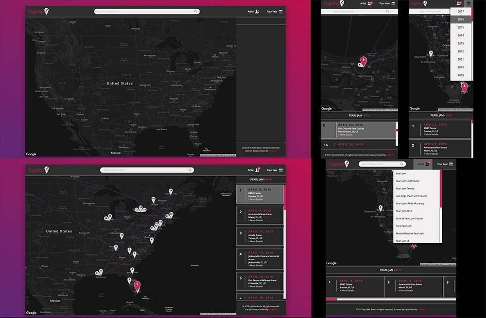

<p>***NOTE:***  This is version 2.0 of an app I originally created in early 2017.  It was completely redesigned and rewritten to be more stable and more responsive.  I also wanted to rewite it after having gained a much better understanding of the latest HTML and CSS features and specs.  Additionally new technologies such as SASS were used when building this version, and it uses the latest CSS Grid along with Flexbox to improve responsiveness with less code.  To see the old version you can visit this <a href="https://bushmb.github.io/GigMap/">page.</a></p>


<h1>GigMap</h1>
<p><a href="https://bushmb.github.io/GigMap2_0/">GigMap</a> is a responsive front-end application that allows users see where there favorite musicians have toured througout the years.  By utilizing the Songkick API, GigMap has full access to almost to a list of almost every concert played by any musical artist.  Broken down by year, and using the Google Maps API, the user is able to track their favorite artists as they hop around the country and the world.</p>



## Getting started
### Installing
```
>   git clone https://github.com/Bushmb/GigMap2_0.git
>   cd gigmap2_0
>   npm install
```
### Launching 

```
>   npm start
```

Then open [`localhost:8080`](http://localhost:8080) in a browser if a window is not automatically opened for you.


<h2>Introduction</h2>
<p>GigMap was one of the first large apps I created, and was built as a way to learn how to get data from and API and display it in a useful way.  I have always loved music and especially seeing my favorite bands in concerts.  I thought it would be a cool idea to be able to show where any band or musican has toured around the globe throughout the years.  But utilizing both the Songkick API for concert data, and the Google Maps API to display their tours, the user is able to virutally follow their favorite bands around the world.</p>

<h2>How it Works</h2>
<h3>Search for a Band or Musical Artist</h3>
<p>Choose a musical artist, any musical artist.  Once you type it into the search bar, GigMap uses Songkick to show that artists concert history throughout the years.  GigMap will attempt to display the concert history starting with 2017 for the artist which most closley matches your search.  If the artist is incorrect, or there is no concert data, you can use the drop down menus in the upper right corner of the app to select new search criteria.  Typically, the artist icon will display a bubble indicating how many other artist matched your search, allowing you to choose another.</p>

<h3>Choosing a Concert</h3>
<p>Once the artist and year has been selected, you can see where in the world that band or musician has played.  The list either to the right, or below the map (depending on screen size) will allow you to see more information about each individual concert, including the date, venue, and geographical location.  It allow gives you a link which will take you to Songkick's website for more information about that specific concert.  The map will also zoom in and highlight that specific concert on the map, allowing you to see exactly what city they performed in.</p>

<h2>Technology</h2>
<ul>
  <li>HTML5</li>
  <li>CSS3</li>
  <li>JavaScript</li>
  <li>jQuery</li>
  <li>Sass</li>
</ul>
<h3>APIs used</h3>
<ul>
  <li>Songkick</li>
  <li>Google Maps</li>
</ul>

<h3>Responsive</h3>
<ul>
  <li>The app is fully responsive thanks to the lastest CSS Grid features, and uses flexbox throughout to provide full flexiblity when scaling to any screen size or device.</li>
</ul>